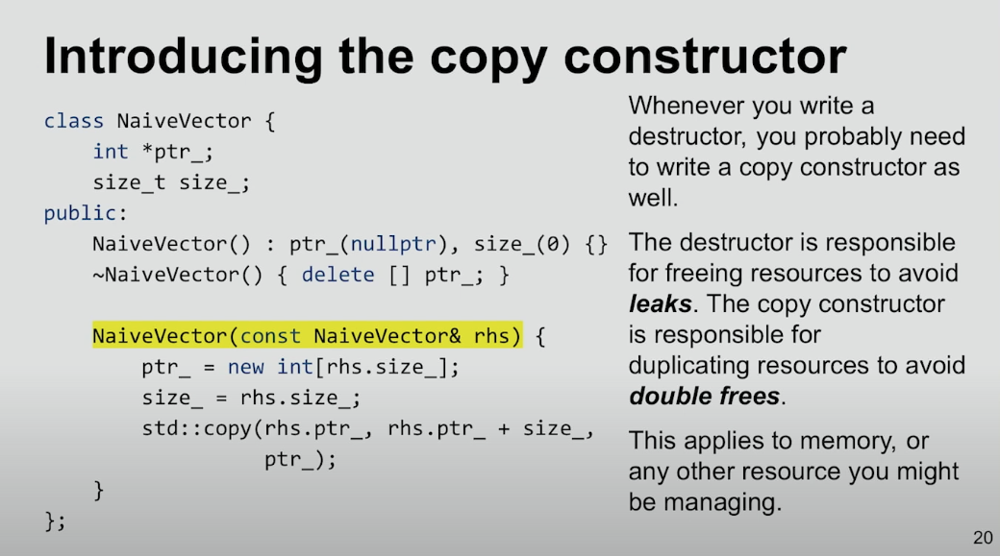
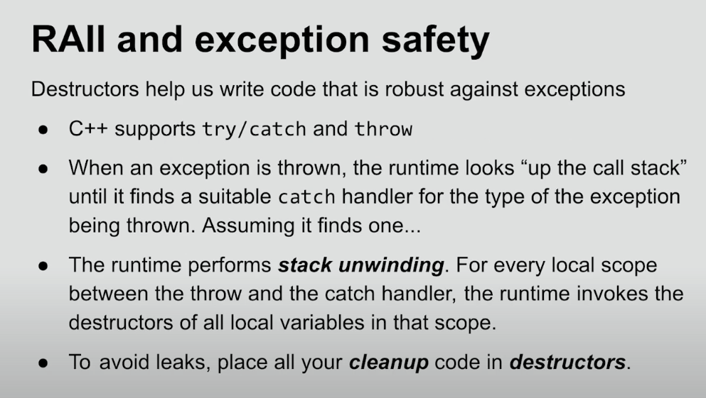

## RAII: Resource Acquisition is Initialisation

C++ program can have different type of resources:
- Allocated memory on heap
- FILE handles (fopen, fclose)
- Mutex Locks
- C++ threads

Some of these resources are `unique` like mutex lock and some can be duplicated
like heap allocations and file handlers (they can be `duped`).
> Some actions needs to be taken by the program in order to free these resources.

Try to do cleanups in the destructor of the object. Since destructor is always
called whenever the object goes out of scope: we don't need to release resources
explicitly.

```cpp
class NaiveVector {
    int* arr;
    size_t size;

    // assume we have released resource in destructor
}

{
    NaiveVector v;
    v.push_back(1);
    {
        NaiveVector w = v;  // this would also copy the pointer int* arr
    } // here int * arr would be released since w is now out of scope

    std::cout << v[0] << '\n';  // this is invalid now. since arr is deleted

}  // double delete here. arr is already freed, we will free it again.

// the problem above was, NaiveVector w = v, will copy all the member variables
// as it is, if we don't define our custom copy constructor.
```
#### Adding copy constructor
The destructor was responsible for freeing resources to avoid any leaks. The
copy constructor is responsible for duplicating resources to avoid double frees.



**Initialisation vs Assignment**
```cpp
// 1. This is initialisation (construction). Calls copy constructor
NaiveVector w = v; 

// 2. This is assignment to existing object w. Calls assignment operator
NaiveVector w;
w = v;
```



In C++, the handling of `try-catch` blocks during an exception involves manipulating the **call stack**. Here’s how it works step by step:

### 1. **Normal Execution and Call Stack Behavior**
- Under normal execution, each function call pushes a new stack frame onto the call stack.
- This stack frame holds local variables, return addresses, and other function context.
- When a function completes, its stack frame is popped off, and control returns to the calling function.

### 2. **When an Exception is Thrown**
When an exception is thrown inside a `try` block:
- The program immediately **stops executing** the normal flow of code and begins **unwinding the call stack**.
- This process is known as **stack unwinding**.

### 3. **Stack Unwinding**
During stack unwinding:
- The function that threw the exception doesn’t return normally. Instead, the runtime looks for a `catch` block that can handle the exception.
- As the runtime searches for the appropriate `catch`, it starts **popping stack frames** off the call stack, effectively **exiting functions** in reverse order until a suitable handler is found.
- If any objects are going out of scope as part of this unwinding (i.e., objects with automatic storage duration in the stack frames), their destructors are called to properly clean up resources. This ensures that **RAII** (Resource Acquisition Is Initialization) is respected, and resources such as memory or file handles are properly released.

### 4. **Finding the Appropriate `catch` Block**
- The runtime checks each function in the call stack, starting with the function where the exception was thrown, to see if there is a `catch` block that matches the exception type.
- If a matching `catch` block is found, control is transferred to it, and the stack unwinding stops.
- If no matching `catch` block is found in the current function, the stack unwinding continues to the next function in the call stack.

### 5. **Uncaught Exceptions**
- If the runtime unwinds all the way through the call stack without finding a matching `catch` block, the program terminates.
- In this case, the runtime will call `std::terminate`, which by default ends the program, often producing an error message like "terminate called after throwing an instance of...".

### Example:

```cpp
#include <iostream>
#include <stdexcept>

void funcC() {
    std::cout << "In funcC\n";
    throw std::runtime_error("Exception in funcC");
}

void funcB() {
    std::cout << "In funcB\n";
    funcC();  // Call to funcC, which will throw an exception
    std::cout << "In funcB after exception\n";  // won't be printed
}

void funcA() {
    std::cout << "In funcA\n";
    try {
        funcB();  // Call to funcB, which will call funcC and eventually throw an exception
        std::cout << "In func A return\n";  // won't be printed
    } catch (const std::exception& e) {
        std::cout << "Caught exception: " << e.what() << '\n';
    }
}

int main() {
    funcA();  // Start the chain of function calls
    return 0;
}
```

### Output:
```plaintext
In funcA
In funcB
In funcC
Caught exception: Exception in funcC
```

### What Happens in the Call Stack:
1. **`main`** calls **`funcA`**, which adds a stack frame for `funcA` to the call stack.
2. **`funcA`** calls **`funcB`**, which adds another stack frame for `funcB` to the call stack.
3. **`funcB`** calls **`funcC`**, which adds yet another stack frame for `funcC` to the call stack.
4. **`funcC`** throws a `std::runtime_error`. The runtime starts stack unwinding.
   - The stack frame for `funcC` is popped off the stack, and the destructor of any local variables in `funcC` (if any) are called.
5. **`funcB`** doesn’t have a `catch` block, so its stack frame is also popped off the stack, and local objects (if any) are destroyed.
6. Control reaches **`funcA`**, which has a matching `catch` block for `std::exception`. The exception is caught, and stack unwinding stops.
7. The program continues execution in the `catch` block of `funcA`.


- **RAII**: Objects are properly destroyed even during stack unwinding, as destructors are automatically invoked.

- If a matching `catch` block is found, the exception is handled; otherwise, the program terminates.


### The Rule of Zero
If your class does not directly manage any resource, but merely use library 
components such as vector and string, then write NO special member function.

Let the compiler generate all of them default:
- Default destructor
- Default copy constructor
- Default copy assignment operator 

```cpp
#include <iostream>
#include <cstring>

class MyString {
private:
    char* data; // Dynamically allocated memory to hold a string
public:
    // 1. Default Constructor
    MyString(const char* str = "") {
        data = new char[std::strlen(str) + 1];
        std::strcpy(data, str);
        std::cout << "Constructor called\n";
    }

    // 2. Destructor
    ~MyString() {
        delete[] data;
        std::cout << "Destructor called\n";
    }

    // 3. Copy Constructor
    MyString(const MyString& other) {
        data = new char[std::strlen(other.data) + 1];
        std::strcpy(data, other.data);
        std::cout << "Copy Constructor called\n";
    }

    // 4. Copy Assignment Operator
    MyString& operator=(const MyString& other) {
        if (this == &other) return *this; // Self-assignment check

        delete[] data; // Release old memory
        data = new char[std::strlen(other.data) + 1]; // Allocate new memory
        std::strcpy(data, other.data); // Copy the data
        std::cout << "Copy Assignment Operator called\n";
        return *this;
    }

    // 5. Move Constructor
    MyString(MyString&& other) noexcept : data(other.data) {
        other.data = nullptr; // Release ownership of the moved-from object
        std::cout << "Move Constructor called\n";
    }

    // 6. Move Assignment Operator
    MyString& operator=(MyString&& other) noexcept {
        if (this == &other) return *this; // Self-assignment check

        delete[] data; // Release old memory
        data = other.data; // Steal the data pointer
        other.data = nullptr; // Release ownership of the moved-from object
        std::cout << "Move Assignment Operator called\n";
        return *this;
    }

    // Helper method to print the string
    void print() const {
        std::cout << "String: " << (data ? data : "null") << '\n';
    }
};

int main() {
    MyString s1("Hello");
    MyString s2 = s1; // Invokes Copy Constructor
    MyString s3;
    s3 = s1; // Invokes Copy Assignment Operator

    MyString s4 = std::move(s1); // Invokes Move Constructor
    MyString s5;
    s5 = std::move(s2); // Invokes Move Assignment Operator

    s4.print();
    s5.print();

    return 0;
}
```