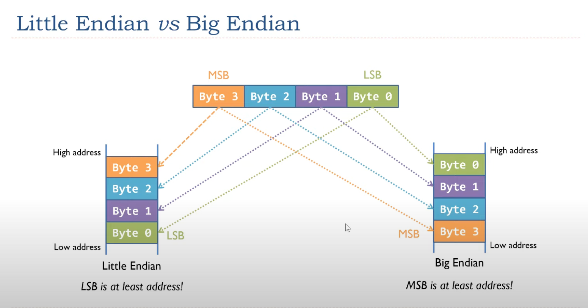
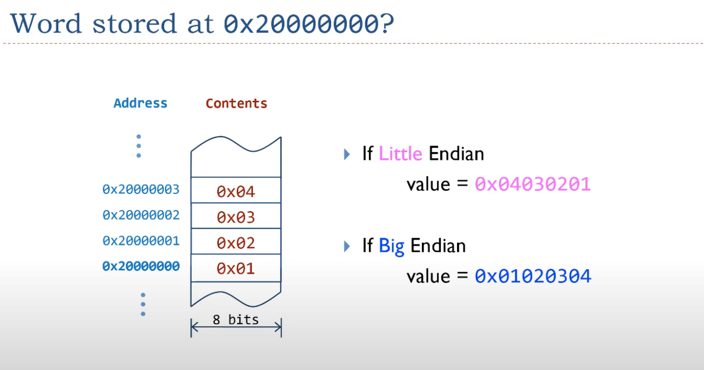

## The Lost Art of Structure Packing & Unaligned Memory Accesses

[Padding and Packing](http://www.catb.org/esr/structure-packing/)

[Memory Alignment](https://docs.kernel.org/core-api/unaligned-memory-access.html)

Unaligned memory accesses occur when you try to read `N` bytes of data starting 
from an address that is not evenly divisible by `N` (i.e. `addr % N != 0`). 

For example, reading 4 bytes of data from address `0x10004` is fine, but reading 
4 bytes of data from address `0x10005` would be an unaligned memory access.

`Natural Alignment`: When accessing `N bytes` of memory, the base memory address 
must be evenly divisible by `N`, i.e. `addr % N == 0`.

*When writing code, assume the target architecture has natural alignment requirements.*

### Why unaligned access is bad

The effects of performing an unaligned memory access vary from architecture 
to architecture. A summary of the common scenarios is presented below:

- Some architectures are able to perform unaligned memory accesses transparently, 
but there is usually a significant performance cost.

- Some architectures raise processor exceptions when unaligned accesses happen. 
The exception handler is able to correct the unaligned access, at significant 
cost to performance.

- Some architectures raise processor exceptions when unaligned accesses happen, 
but the exceptions do not contain enough information for the unaligned access to 
be corrected.

- Some architectures are not capable of unaligned memory access, but will 
silently perform a different memory access to the one that was requested, 
resulting in a subtle code bug that is hard to detect!

If our code causes unaligned memory accesses to happen, out code will not work 
correctly on certain platforms and will cause performance problems on others.

### How Compiler helps

The way our compiler lays out basic datatypes in memory is constrained in order 
to make memory accesses faster.

*Each type except `char` has an alignment requirement: `chars` can start on any 
byte address, but `2-byte shorts` must start on an even address, `4-byte ints` 
or `floats` must start on an address divisible by 4, and `8-byte longs` or 
`doubles` must start on an address divisible by 8. 
Signed or unsigned makes no difference.*

Self-alignment makes access faster because it facilitates generating 
single-instruction fetches and puts of the typed data. Without alignment 
constraints, on the other hand, the code might end up having to do two or more 
accesses spanning machine-word boundaries. 

Characters are a special case: they’re equally expensive from anywhere they 
live inside a single machine word. That’s why they don’t have a preferred alignment.

```cpp
// consider these variables declaration
char *p;
char c;
int x;

// actual layout in memory
char *p;      /* 4 or 8 bytes */
char c;       /* 1 byte */
char pad[3];  /* 3 bytes */
int x;        /* 4 bytes */
```

```cpp
// consider these variables declaration
char *p;
char c;
long x;

// actual layout in memory
char *p;     /* 8 bytes */
char c;      /* 1 byte */
char pad[7]; /* 7 bytes */
long x;      /* 8 bytes */
```


#### Structure alignment and padding

```cpp
struct foo1 {
    char *p;
    char c;
    long x;
};

// Assuming a 64-bit machine, any instance of struct foo1 will have 8-byte alignment.

struct foo1 {
    char *p;     /* 8 bytes */
    char c;      /* 1 byte
    char pad[7]; /* 7 bytes */
    long x;      /* 8 bytes */
};

```

```cpp
struct foo5 {
    char c;
    struct foo5_inner {
        char *p;
        short x;
    } inner;
};

// The char *p member in the inner struct forces the outer struct to be pointer-aligned as well as the inner. 

struct foo5 {
    char c;           /* 1 byte*/
    char pad1[7];     /* 7 bytes */
    struct foo5_inner {
        char *p;      /* 8 bytes */
        short x;      /* 2 bytes */
        char pad2[6]; /* 6 bytes */
    } inner;
};
```

Now that we know how and why compilers insert padding in and after our structures 
we’ll examine what we can do to squeeze out the slop. 
This is the art of structure packing.

The first thing to notice is that slop only happens in two places:
- One is where storage bound to a larger data type (with stricter alignment 
requirements) follows storage bound to a smaller one. 
- The other is where a struct naturally ends before its stride address, requiring 
padding so the next one will be properly aligned.

The simplest way to eliminate slop is to reorder the structure members by 
decreasing alignment. 

That is: make all the pointer-aligned subfields come first, because on a 64-bit 
machine they will be 8 bytes. Then the 4-byte ints; then the 2-byte shorts; 
then the character fields.

#### Overriding Alignment Rules

We can ask our compiler to not use the processor’s normal alignment rules by 
using a pragma, usually `#pragma pack`.

*Do not do this casually, as it forces the generation of more expensive and slower code.*

```cpp
#pragma pack(1)  // Force 1-byte alignment
struct PackedExample {
    char a;  // 1 byte
    int b;   // 4 bytes
};

// Here, b is no longer aligned on a 4-byte boundary. 
// It forces the CPU to perform unaligned memory accesses.

#pragma pack()  // Reset to default alignment
```

### Endianness: Big Endian and Little Endian
It specifies the order in which bytes of a word are stored in memory.

*`x86(32/64 bit)` is `little-endian`.*

*While `ARM` defaults to `little-endian`, it can be configured to operate in 
big-endian mode as well.*

(Big-Endian is actually more intuitive at first sight!`)




x86(32/64 bit), ARM are little-endian.